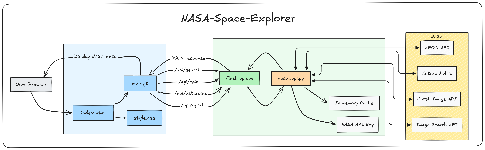

# NASA-Space-Explorer

An easy-to-use Flask application aggregating NASA Open API with an interactive space dashboard. View today's Astronomy Picture of the Day, search for Near-Earth asteroids, check the latest from Earth's EPIC camera or query NASA's public image archive using a keyword.

<p align="center">
  
</p>

## Features

- APOD gives for today's image and description
- Asteroid tracking for objects passing near Earth
- EPIC Earth imagery for a chosen date
- Keyword-based NASA image search across the public catalog
- Caching to reduce redundant API calls and improve responsiveness
- Simple Flask frontend with JavaScript-driven data fetching

## Tech Stack

- Python 3
- Flask
- Requests
- python-dotenv
- NASA Open APIs

## Project Structure

```text
NASA/
├── app.py                  # Flask app and API routes
├── nasa_api.py             # NASA API client + caching logic
├── index.html              # UI layout
├── main.js                 # Client-side fetch/render logic
├── style.css               # Styling for the dashboard
├── env.example             # Example environment file
├── requirements.txt        # Python dependencies
├── README.md               # Project documentation
├── assets/
│   └── nasa-space-explorer-architecture.svg
└── .env                    # your local API key (not committed)
```

## Getting Started

### 1. Clone the project

```bash
git clone <your-repo-url>
cd NASA
```

### 2. Create a virtual environment

```bash
python -m venv env
```

On Windows:

```bash
env\Scripts\activate
```

On macOS/Linux:

```bash
source env/bin/activate
```

### 3. Install dependencies

```bash
pip install -r requirements.txt
```

### 4. Add your NASA API key

Create a `.env` file in the project root based on `env.example`:

```env
NASA_API_KEY=your-nasa-api-key
```

You can get a free key from the NASA API portal: https://api.nasa.gov/

### 5. Run the app

```bash
python app.py
```

Then open:

```text
http://localhost:5000
```

## API Endpoints

The app exposes these internal routes:

- `GET /` — main dashboard page
- `GET /api/apod` — returns APOD data
- `GET /api/asteroids` — returns asteroid information for today
- `GET /api/epic?date=YYYY-MM-DD` — returns EPIC Earth images for a date
- `GET /api/search?q=keyword` — returns image search results

## Notes

- The app uses a small in-memory cache to reduce repeated API requests.
- The default API key in `nasa_api.py` is a test key, but the app expects your own `.env` value for normal use.
- If NASA rate limits are reached, the app returns a friendly error message rather than crashing.

## License

MIT License — see [LICENSE](LICENSE).

## Author

Veda S M
[GitHub](https://github.com/vedasm) · [LinkedIn](https://linkedin.com/in/vedasm)